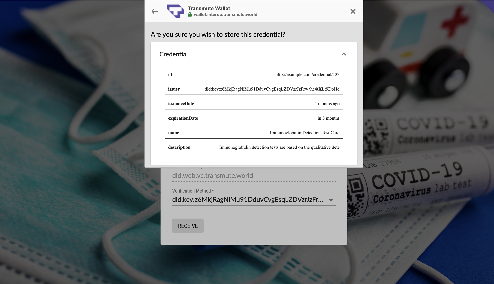
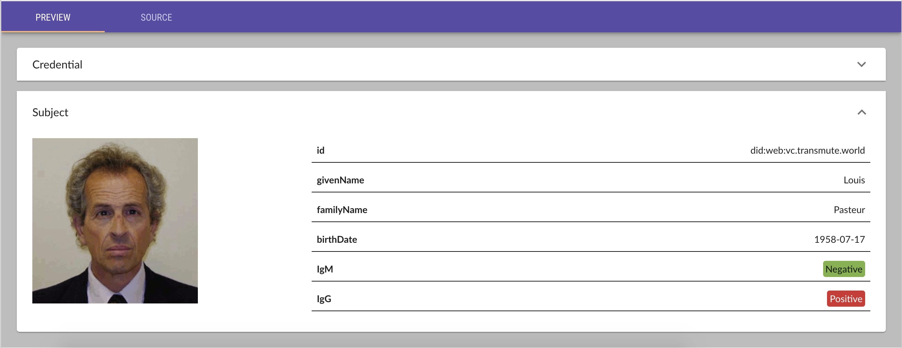

# Immunity Passport

#### These are hypothetical, DO NOT USE THIS IN PRODUCTION.

## Communities Working on COVID-19 Credentials

- [http://covid19credentials.com](http://covid19credentials.com)
- DIF is forming a WG
- W3C CCG has hosted some good conversations on "W3C Credentials CG (Public List)" <public-credentials@w3.org>

## Versioning

Versions may be signicantly different from eachother or contain non-interoperable breaking changes. All versions should be considerd unstable, so for example, "v1" may be updated continiously with breaking changes.

- [v1](./v1) IgM & IgG with PII
- [v2](./v2)

## Standards and Tools

- [Credential Handler API 1.0](https://w3c-ccg.github.io/credential-handler-api/)
- [Verifiable Credentials Data Model 1.0](https://www.w3.org/TR/vc-data-model/)
- [Demo Issuer Website](https://github.com/decentralized-identity/c19-vc.com)

### Delivering Verifiable Credentials from a Website

### Viewing a Verifiable Credential in a Web Wallet

