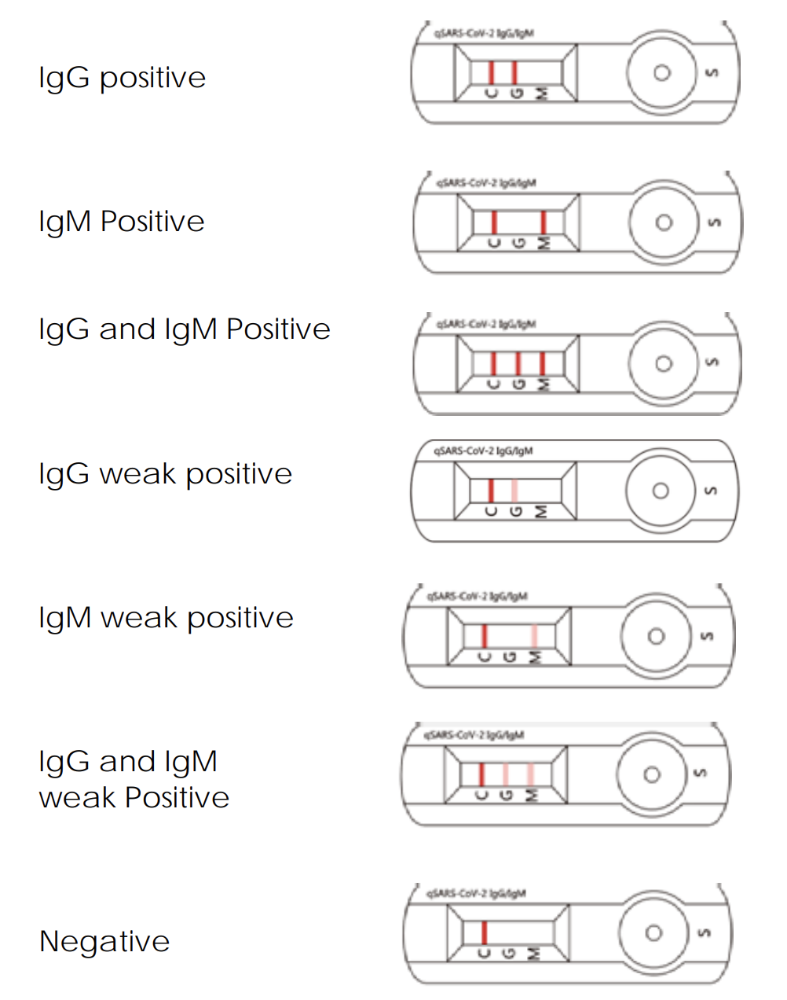
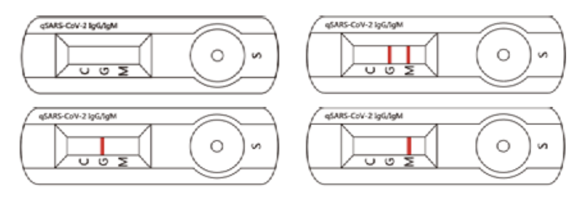

#### Feedback from v1

##### 1. Don't define medical vocabularly

"IgM" / "IgG" fields, represented as booleans vs strings / not using existing medical vocabulary.

##### 2. Don't require DIDs / signing

Can't assume that a subject will be able to create a Verifiable Presentation, or that they have the ability to create digital signatures linked to their identifier.

##### 3. Don't embed PII

Some people wanted an embedded existing identifier like a Drivers License or a hash of one.

Others wanted no PII at all.

Linking the test result to an existing real world identity seemes to be the crux of the matter.

## Thanks to the [DIF](https://identity.foundation/), [W3C-CCG](https://w3c-ccg.github.io/) & [CCI](https://www.covidcreds.com/) for providing feedback on v1!

### Summary of approach for v2

v2 is based on the the Food and Drug Administration (FDA) issuance of an
Emergency Use Authorization (EUA) for emergency use a specific test [qSARS-CoV-2 IgG/IgM Rapid Test](https://www.fda.gov/media/136622/download).

The company named in the EUA is [Cellex](http://www.cellex.us/).

The following hypothetical verifiable credential formats are based off:

- [qSARS-CoV-2 IgG/IgM Rapid Test IFU](https://cellexcovid.com/wp-content/uploads/2020/04/Cellex-rapid-ifu.pdf)

It seems advantageous to split v2 into 2 credentials.

1. [COVID-19 Test Results Credential](./qSARS-CoV-2-Rapid-Test-Credential.json)
2. [COVID-19 Travel Badge Credential](./qSARS-CoV-2-Travel-Badge-Credential.json)

## COVID-19 Test Results Credential

We don't know how testing will evolve, but we think that authorities will rely on test results when considering if an individual should be allowed to travel.

From the "qSARS-CoV-2 IgG/IgM Rapid Test IFU":

1. Valid Assay

   1.1 In addition to the presence of the C Line, if only the G
   Line is developed, the test result indicates the
   presence of IgG anti- SARS-CoV-2 virus. The result is
   IgG positive or reactive, consistent with a recent or
   previous infection.

   1.2 In addition to the presence of the C Line, if only the M
   Line is developed, the test indicates the presence of
   IgM anti-SARS-CoV-2 virus. The result is IgM positive or
   reactive, consistent with an acute or recent SARSCoV-2 virus infection.
   Cellex qSARS-CoV-2 IgG/IgM Rapid Test

   1.3 In addition to the presence of the C Line, if both G
   and M Lines are developed, the test indicates the
   presence of IgG and IgM anti-SARS-CoV-2 virus. The
   result is IgG and IgM positive or reactive, suggesting
   current or recent SARS-CoV-2 virus infection.

   Negative results do not rule out SARS-CoV-2 infection,
   particularly for patients who have been in contact with
   known infected persons or in areas with high prevalence of
   active infection. Follow-up testing with a molecular
   diagnostic test is necessary to rule out infection in these
   individuals.

   Results from antibody testing should not be used as the
   sole basis to diagnose or exclude SARS-CoV-2 infection.
   False positive results may occur due to cross-reacting
   antibodies from previous infections, such as other
   coronaviruses, or from other causes
   Samples with positive results should be confirmed with
   alternative testing method(s) and clinical findings before a
   diagnostic determination is made.

2. Invalid Assay

   If the C Line does not develop, the assay is invalid regardless of
   color development of the G or M Lines as indicated below.
   Repeat the assay with a new device.

Let's assume professionals will not issue a "COVID-19 Test Results Credential" for an invalid assay.

### How can we transform a test result to a credential?

Control line is always present, can be ignored from a modeling perspective.

Should include Catalog Number for test "5515C025, 5515C050, 5515C100"

Should include reference to IFU: https://cellexcovid.com/wp-content/uploads/2020/04/Cellex-rapid-ifu.pdf

Cases for a valid assay:

- IgM Positive
- IgM Weak Positive

- IgG Positive
- IgG Weak Positive

- IgM and IgG Positive
- IgM and IgG Weak Positive

- Negative

Needs to be bound to _some_ subject identifier... since this seems to be the most contensious part, lets just not define it :)

- `credentialSubject.id` can be a DID / Hash of Driver License Number / GUID / existing patient identifier...

## COVID-19 Travel Badge Credential

Because the "COVID-19 Test Results Credential" `credentialSubject.id` can be anything, the "COVID-19 Travel Badge Credential" can also be anything.

These values could be the same or different.

For example, the test result credential might be issued to a patient identifier, but the travel badge might be issued to a drivers license number of permanent resident card.

### What fields are required for a travel badge?

1. issuanceDate and expirationDate

2. issuer details.

3. optional PII

In the case where the `credentialSubject.id` is not a link to some ID card with am image, how will a verifier inspect a travel badge?

Embedding an image in the travel badge allows it to be "issued to a likeness", even if the `credentialSubject.id` is a GUID.

## Examples

- [Rapid Test Credential](./qSARS-CoV-2-Rapid-Test-Credential.json)
- [Travel Badge Credential](./qSARS-CoV-2-Travel-Badge-Credential.json)
- [JWT Rapid Test Credential](https://jwt.io/#debugger-io?token=eyJraWQiOiJfUXEwVUwyRnE2NTFRMEZqZDZUdm5ZRS1mYUhpT3BSbFBWUWNZXy10QTRBIiwiYWxnIjoiRWREU0EifQ.eyJzdWIiOiJkaWQ6a2V5Ono2TWtqUmFnTmlNdTkxRGR1dkN2Z0VzcUxaRFZ6ckp6RnJ3YWhjNHRYTHQ5RG9IZCIsImlzcyI6ImRpZDp3ZWI6dmMudHJhbnNtdXRlLndvcmxkIiwibmJmIjoxNTc2MDM2MjU1LCJleHAiOjE2MDc2NTg2NTUsInZjIjp7IkBjb250ZXh0IjpbImh0dHBzOi8vd3d3LnczLm9yZy8yMDE4L2NyZWRlbnRpYWxzL3YxIiwiaHR0cHM6Ly93M2MtY2NnLmdpdGh1Yi5pby92Yy1leGFtcGxlcy9jb3ZpZC0xOS92Mi92Mi5qc29ubGQiXSwiaWQiOiJodHRwOi8vZXhhbXBsZS5jb20vY3JlZGVudGlhbC8xMjMiLCJ0eXBlIjpbIlZlcmlmaWFibGVDcmVkZW50aWFsIiwicVNBUlMtQ29WLTItUmFwaWQtVGVzdC1DcmVkZW50aWFsIl0sImlzc3VlciI6eyJpZCI6ImRpZDp3ZWI6dmMudHJhbnNtdXRlLndvcmxkIiwibG9jYXRpb24iOnsiQHR5cGUiOiJDb3ZpZFRlc3RpbmdGYWNpbGl0eSIsIm5hbWUiOiJTdGFuZm9yZCBIZWFsdGggQ2FyZSIsInVybCI6Imh0dHBzOi8vc3RhbmZvcmRoZWFsdGhjYXJlLm9yZy8ifX0sImlzc3VhbmNlRGF0ZSI6IjIwMTktMTItMTFUMDM6NTA6NTVaIiwiZXhwaXJhdGlvbkRhdGUiOiIyMDIwLTEyLTExVDAzOjUwOjU1WiIsIm5hbWUiOiJxU0FSUy1Db1YtMiBJZ0cvSWdNIFJhcGlkIFRlc3QgQ3JlZGVudGlhbCIsImRlc2NyaXB0aW9uIjoiUmVzdWx0cyBmcm9tIGFudGlib2R5IHRlc3Rpbmcgc2hvdWxkIG5vdCBiZSB1c2VkIGFzIHRoZSBzb2xlIGJhc2lzIHRvIGRpYWdub3NlIG9yIGV4Y2x1ZGUgU0FSUy1Db1YtMiBpbmZlY3Rpb24uIEZhbHNlIHBvc2l0aXZlIHJlc3VsdHMgbWF5IG9jY3VyIGR1ZSB0byBjcm9zcy1yZWFjdGluZyBhbnRpYm9kaWVzIGZyb20gcHJldmlvdXMgaW5mZWN0aW9ucywgc3VjaCBhcyBvdGhlciBjb3JvbmF2aXJ1c2VzLCBvciBmcm9tIG90aGVyIGNhdXNlcyBTYW1wbGVzIHdpdGggcG9zaXRpdmUgcmVzdWx0cyBzaG91bGQgYmUgY29uZmlybWVkIHdpdGggYWx0ZXJuYXRpdmUgdGVzdGluZyBtZXRob2QocykgYW5kIGNsaW5pY2FsIGZpbmRpbmdzIGJlZm9yZSBhIGRpYWdub3N0aWMgZGV0ZXJtaW5hdGlvbiBpcyBtYWRlLiIsImNyZWRlbnRpYWxTdWJqZWN0Ijp7ImlkIjoiZGlkOmtleTp6Nk1ralJhZ05pTXU5MURkdXZDdmdFc3FMWkRWenJKekZyd2FoYzR0WEx0OURvSGQiLCJ0eXBlIjpbInFTQVJTLUNvVi0yLVJhcGlkLVRlc3QtQ3JlZGVudGlhbCJdLCJjYXRhbG9nTnVtYmVyIjoiNTUxNUMwMjUsIDU1MTVDMDUwLCA1NTE1QzEwMCIsImlmdSI6Imh0dHBzOi8vY2VsbGV4Y292aWQuY29tL3dwLWNvbnRlbnQvdXBsb2Fkcy8yMDIwLzA0L0NlbGxleC1yYXBpZC1pZnUucGRmIiwiYXNzYXkiOiJOZWdhdGl2ZSJ9fX0.JGIML6Yjg8ka6EjYGbK0I4VApjaVzL88JNe-Wl8NtptNGHMu27U9viVnTD2ZBPffPC7izDpWaCg-sQFr6LrICw)
- [JWT Travel Badge](https://jwt.io/#debugger-io?token=eyJraWQiOiJfUXEwVUwyRnE2NTFRMEZqZDZUdm5ZRS1mYUhpT3BSbFBWUWNZXy10QTRBIiwiYWxnIjoiRWREU0EifQ.eyJzdWIiOiJkaWQ6a2V5Ono2TWtqUmFnTmlNdTkxRGR1dkN2Z0VzcUxaRFZ6ckp6RnJ3YWhjNHRYTHQ5RG9IZCIsImlzcyI6ImRpZDp3ZWI6dmMudHJhbnNtdXRlLndvcmxkIiwibmJmIjoxNTc2MDM2MjU1LCJleHAiOjE2MDc2NTg2NTUsInZjIjp7IkBjb250ZXh0IjpbImh0dHBzOi8vd3d3LnczLm9yZy8yMDE4L2NyZWRlbnRpYWxzL3YxIiwiaHR0cHM6Ly93M2MtY2NnLmdpdGh1Yi5pby92Yy1leGFtcGxlcy9jb3ZpZC0xOS92Mi92Mi5qc29ubGQiXSwiaWQiOiJodHRwOi8vZXhhbXBsZS5jb20vY3JlZGVudGlhbC8xMjMiLCJ0eXBlIjpbIlZlcmlmaWFibGVDcmVkZW50aWFsIiwicVNBUlMtQ29WLTItVHJhdmVsLUJhZGdlLUNyZWRlbnRpYWwiXSwiaXNzdWVyIjp7ImlkIjoiZGlkOndlYjp2Yy50cmFuc211dGUud29ybGQiLCJsb2NhdGlvbiI6eyJAdHlwZSI6IkNvdmlkVGVzdGluZ0ZhY2lsaXR5IiwibmFtZSI6IlN0YW5mb3JkIEhlYWx0aCBDYXJlIiwidXJsIjoiaHR0cHM6Ly9zdGFuZm9yZGhlYWx0aGNhcmUub3JnLyJ9fSwiaXNzdWFuY2VEYXRlIjoiMjAxOS0xMi0xMVQwMzo1MDo1NVoiLCJleHBpcmF0aW9uRGF0ZSI6IjIwMjAtMTItMTFUMDM6NTA6NTVaIiwibmFtZSI6InFTQVJTLUNvVi0yIFRyYXZlbCBCYWRnZSBDcmVkZW50aWFsIiwiZGVzY3JpcHRpb24iOiJUaGlzIGNhcmQgaXMgYWNjZXB0ZWQsIHVuZGVyIHNwZWNpZmllZCBjb25kaXRpb25zLCBhcyBwcm9vZiBvZiBtZWRpY2FsIGNsZWFyYW5jZSBhbmQgZm9yIGlkZW50aWZpY2F0aW9uIG9mIHRoZSBob2xkZXLigJlzIG1lZGljYWwgY29uZGl0aW9uLiBTZWUgaHR0cHM6Ly93d3cud2hvLmludC9pdGgvbW9kZV9vZl90cmF2ZWwvdHJhdmVsbGVycy9lbi8uIiwiY3JlZGVudGlhbFN1YmplY3QiOnsiaWQiOiJkaWQ6a2V5Ono2TWtqUmFnTmlNdTkxRGR1dkN2Z0VzcUxaRFZ6ckp6RnJ3YWhjNHRYTHQ5RG9IZCIsInR5cGUiOlsiUGVyc29uIl0sImltYWdlIjoiaHR0cHM6Ly9jZG4ucGl4YWJheS5jb20vcGhvdG8vMjAxNC8xMC8yNi8yMS80Mi9tYW4tNTA0NDUzXzEyODAuanBnIn19fQ.jaVoZC0lShp6ahzs-yI7hmE-M3OhkY1ialf4pCkEVCv1aVDHXLGOdipgTIGnQ045IIpF5rRc7-2MiItWCfRZBw)
